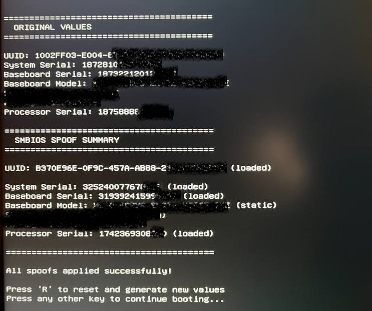

# EFI SMBIOS Spoofer V2

A UEFI-based SMBIOS spoofer that modifies hardware identifiers at the firmware level before Windows boots. This ensures that spoofed values are visible to all software, including anti-cheat systems and hardware fingerprinting tools.

---

## Table of Contents

- [Overview](#overview)
- [Showcase](#showcase)
- [Spoofed Identifiers](#spoofed-identifiers)
- [Key Features](#key-features)
- [How It Works](#how-it-works)
- [Persistence Options](#persistence-options)
- [Building](#building)
- [Installation](#installation)
- [Configuration](#configuration)
- [Troubleshooting](#troubleshooting)

---

## Overview

This spoofer modifies SMBIOS (System Management BIOS) tables in memory during the UEFI boot phase, effectively changing your system's hardware identifiers before the operating system loads.

---

## Showcase



*The spoofer running during UEFI boot phase, modifying hardware identifiers before Windows loads.*

### Spoofed Identifiers

| Identifier | SMBIOS Type | Priority | Description |
|------------|-------------|----------|-------------|
| **System UUID** | Type 1 | CRITICAL | Unique system identifier - Most important for fingerprinting |
| **System Serial Number** | Type 1 | CRITICAL | Motherboard/system serial - Very important for tracking |
| **Baseboard Serial Number** | Type 2 | IMPORTANT | Motherboard serial number - Used for hardware tracking |
| **Processor Serial Number** | Type 4 | OPTIONAL | CPU serial (if available) - Rarely used for fingerprinting |

---

## Key Features

- **Pre-Boot Execution**: Runs before Windows loads, making spoofed values visible system-wide
- **Format Preservation**: Generates new serials matching your original serial format (length, structure, character types)
- **Dual Persistence**: Saves spoofed values to both NVRAM and disk for consistency across reboots
- **Reset Function**: Press `R` during boot to regenerate all values instantly
- **Safe Operation**: Only modifies SMBIOS strings in memory, no permanent changes to firmware

---

## How It Works

### Overview

This spoofer operates at the UEFI (Unified Extensible Firmware Interface) level, which means it runs **before** the operating system loads. This is crucial because:

- Windows reads hardware identifiers from SMBIOS tables during boot
- Anti-cheat software queries these same tables
- By modifying the tables before Windows starts, all software sees the spoofed values

### Technical Flow

```
┌─────────────────────────────────────────────────────────────────┐
│                        UEFI BOOT PROCESS                        │
├─────────────────────────────────────────────────────────────────┤
│  1. Power On → UEFI Firmware Initializes                        │
│  2. UEFI loads SmbiosSpooferV2.efi                              │
│  3. Spoofer scans memory for SMBIOS Entry Point (_SM_ signature)│
│  4. Locates SMBIOS tables (Type 1, Type 2, Type 4)              │
│  5. Patches strings directly in memory                          │
│  6. Windows Boot Manager loads with spoofed values              │
│  7. Windows sees modified hardware identifiers                  │
└─────────────────────────────────────────────────────────────────┘
```

### Step-by-Step Process

1. **Boot Phase**: The EFI application loads before Windows during UEFI boot

2. **Table Discovery**: Scans memory region `0xF0000-0xFFFFF` looking for the SMBIOS anchor string `_SM_`. Once found, it reads the Structure Table Address to locate all SMBIOS structures.

3. **Value Loading**: Checks two persistence locations:
   - NVRAM variable `SmbiosSpoof` (stored in UEFI firmware)
   - Disk file `\EFI\SmbiosSpoofer\uuid.dat`
   
   **Why two methods?** NVRAM is the primary method as it survives OS reinstalls and firmware updates. Disk storage acts as a fallback when NVRAM access fails or is unavailable. The spoofer tries NVRAM first, then falls back to disk if needed.
   
   **Important:** If no saved values exist, new random values are generated. Persistence is only for saving/loading values between reboots - it does not affect whether spoofing works.

4. **Format-Matching Generation**: If no saved values exist, the spoofer:
   - Reads original serial numbers from SMBIOS
   - Analyzes their format (length, character patterns)
   - Generates new random values matching the same format
   - This makes spoofed values look realistic

5. **Memory Patching**: Uses the `EditString()` function to directly modify SMBIOS string data in memory. The function:
   - Locates the string table after the structure
   - Overwrites characters in-place (same length requirement)
   - No checksums are updated (not verified by Windows)

6. **UUID Modification**: The 16-byte UUID in Type 1 structure is directly overwritten with random bytes (RFC 4122 format).

7. **Persistence**: Saves generated values so future boots use the same spoofed identity.

8. **Handoff**: Control passes to Windows bootloader with spoofed values active

### Why EFI-Level Spoofing?

| Method | Detection Risk | Persistence | Complexity |
|--------|---------------|-------------|------------|
| **EFI Spoofer** | Very Low | High | Medium |
| Registry Edit | High | Low | Low |
| Driver Hook | Medium | Medium | High |
| WMI Intercept | High | Low | Medium |

EFI-level spoofing is harder to detect because:
- No kernel drivers to scan for
- No user-mode hooks to detect
- Values appear "native" to the system
- Runs before any anti-cheat loads

---

## Persistence Options

**Important distinction:** Persistence (NVRAM/Disk) and SMBIOS spoofing are two separate processes:

- **Persistence**: Saves/loads spoofed values between reboots (optional convenience feature)
- **SMBIOS Spoofing**: Directly patches SMBIOS tables in memory (always works)

**SMBIOS spoofing will work regardless of persistence status:**
- If NVRAM fails: Spoofing still works, values can be loaded/saved from disk
- If both fail: Spoofing still works, new random values are generated each boot
- Persistence only affects whether the same values are reused across reboots

The spoofer supports two persistence methods (configurable in `src/Config.h`):

### NVRAM Persistence

Stores spoofed values in UEFI firmware NVRAM using UEFI Runtime Services:

**How it works:**
- Uses `SetVariable()` / `GetVariable()` from UEFI Runtime Services (gRT)
- Variable name: `SmbiosSpoof`
- GUID: `8BE4DF61-93CA-11D2-AA0D-00E098032B8C` (EFI Global Variable GUID)
- Attributes: `EFI_VARIABLE_NON_VOLATILE | EFI_VARIABLE_BOOTSERVICE_ACCESS`

**Data structure:**
```
NVRAM_SPOOF_CONFIG {
    Magic: 0x534D4249 ("SMBI") - Verification signature
    Version: 5 - Structure version
    UUID[16] - System UUID
    SystemSerial[64] - System Serial Number
    BiosSerial[64] - BIOS Serial
    BaseboardSerial[64] - Baseboard Serial
    BaseboardModel[64] - Baseboard Model
    ProcessorSerial[64] - Processor Serial
    Checksum - Data integrity check
}
```

**Advantages:**
- Stored in firmware, survives OS reinstalls and disk formatting
- Persistent across system reboots and firmware updates
- Primary method - tried first when loading values

**Important Limitations:**
- NVRAM variables are cleared during CMOS reset or BIOS reset
- Battery removal or motherboard jumper reset will erase NVRAM data
- Always enable disk persistence as backup even if NVRAM works

**Compatibility:**
- Uses multiple fallback methods with different attributes if first attempt fails
- Some systems may restrict NVRAM write access (use disk persistence instead if NVRAM fails)
- If NVRAM write fails, spoofing still works - only persistence is affected

### Disk Persistence

Saves to `\EFI\SmbiosSpoofer\uuid.dat` (backup method):
- Fallback when NVRAM is unavailable or restricted
- Backup for when NVRAM is cleared (CMOS/BIOS reset, battery removal)
- Requires EFI System Partition to be writable
- May be lost if ESP is formatted or cleared

**Recommendation:** Always enable both NVRAM and disk persistence. Disk acts as a backup that survives CMOS resets, while NVRAM provides firmware-level persistence.

**Flow if NVRAM fails but disk works:**
1. Load values from disk → SUCCESS
2. Apply SMBIOS spoofing → WORKS (patches memory directly)
3. Save to NVRAM → FAIL (cannot write)
4. Save to disk → SUCCESS (backup method)

The dual-persistence approach ensures values are maintained even if one method fails. However, SMBIOS spoofing itself operates independently of persistence.

---

## Building

**Pre-built Binary Available:** If you don't want to build from source, a ready-to-use `.efi` file is available in the `releases/` folder. You can skip the build steps and go directly to [Installation](#installation).

### Required Tools

| Tool | Version | Installation | Verification |
|------|---------|--------------|--------------|
| **EDK2** | Latest stable | `git clone https://github.com/tianocore/edk2.git && cd edk2 && git submodule update --init --recursive` | Workspace: `C:\edk2` |
| **Visual Studio 2022** | Community/Pro/Enterprise | Install with: Desktop C++, Windows SDK, MSVC v143 | `cl.exe` in PATH |
| **Python 3** | 3.8+ | Download from python.org or Windows Store | `python --version` |
| **NASM** (optional) | 2.15+ | Download from nasm.us, add to PATH | `nasm --version` |

### Build Steps

```bash
# 1. Setup EDK2
git clone https://github.com/tianocore/edk2.git
cd edk2
git submodule update --init --recursive

# 2. Copy project to EDK2 workspace
cp -r SmbiosSpooferV2 C:\edk2\

# 3. Build (Windows)
build -a X64 -t VS2022 -p SmbiosSpooferV2/SmbiosSpooferV2.dsc -b RELEASE

# Build output: Build/SmbiosSpooferV2/RELEASE_VS2022/X64/SmbiosSpooferV2.efi
```

**Note:** MdePkg libraries and UEFI protocols are automatically provided by EDK2.

---

## Installation

**Note:** A pre-compiled `.efi` file is available in the `releases/` folder. You can use this directly without building from source.

### Prerequisites

**Before installing, ensure the following UEFI firmware settings are configured:**

1. **Secure Boot: DISABLED**
   - Enter UEFI/BIOS settings (usually `F2`, `F10`, `DEL`, or `ESC` during boot)
   - Navigate to Security/Boot settings
   - Disable "Secure Boot"
   - Save and exit
   - **Why:** Unsigned EFI applications cannot run with Secure Boot enabled

2. **CSM/Legacy Boot Mode: DISABLED**
   - Ensure UEFI mode is enabled (not Legacy/CSM mode)
   - Some systems call this "UEFI Boot Mode" or "Boot Mode: UEFI"
   - **Why:** This spoofer requires UEFI firmware, not legacy BIOS

3. **Fast Boot: Optional (Recommended: DISABLED)**
   - Disable "Fast Boot" for easier access to UEFI settings
   - Helps with debugging if issues occur

4. **TPM (Trusted Platform Module): Optional**
   - TPM can remain enabled, but some systems may require disabling for EFI modification access
   - Only disable if you experience boot issues

### Installation Steps

1. Copy the compiled `SmbiosSpooferV2.efi` to your EFI System Partition (ESP)
   - Typically located at `C:\EFI\` or mounted at `/boot/efi/` on Linux
   - Or use the pre-built file from `releases/SmbiosSpooferV2.efi`

2. Add a boot entry using one of the following methods:

   **Method A: Using bcdedit (Windows)**
   ```bash
   bcdedit /copy {bootmgr} /d "SMBIOS Spoofer"
   bcdedit /set {NEW_GUID} path \EFI\SmbiosSpoofer\SmbiosSpooferV2.efi
   ```

   **Method B: Using UEFI Shell (bcfg)**
   ```bash
   # List current boot entries
   bcfg boot dump
   
   # Add new boot entry (replace N with available slot number)
   bcfg boot add N fs0:\EFI\SmbiosSpoofer\SmbiosSpooferV2.efi "SMBIOS Spoofer"
   
   # Verify entry was added
   bcfg boot dump
   ```

3. **Set boot order**: Configure your UEFI firmware to boot from the SMBIOS Spoofer entry **first** in boot order. The spoofer must run before Windows loads.

4. Boot from the new entry before starting Windows or reinstalling Windows

**Important Notes:**
- The spoofer **must always boot first** before Windows to modify SMBIOS tables
- You can run it from USB if preferred, but this is unnecessary and may be more detectable
- For best results, install permanently to ESP and set as first boot option in UEFI settings

---

## Configuration

Edit `src/Config.h` to customize behavior:

```c
// Spoofing options
// 0 = Disabled, 1 = Enabled
#define SPOOF_SYSTEM_SERIAL     1  // Enable/disable System Serial spoofing
#define SPOOF_BIOS_SERIAL       0  // BIOS Serial spoofing (disabled by default)
#define SPOOF_BASEBOARD_SERIAL  1  // Enable/disable Baseboard Serial spoofing
#define SPOOF_BASEBOARD_MODEL   0  // Baseboard Model (disabled - keep original)
#define SPOOF_PROCESSOR_SERIAL  1  // Enable/disable Processor Serial spoofing

// Persistence options
// 0 = Disabled, 1 = Enabled
#define USE_NVRAM_PERSISTENCE   1  // Enable NVRAM storage
#define USE_DISK_PERSISTENCE    1  // Enable disk-based storage
```

**Configuration Values:**
- `0` = Disabled (feature off)
- `1` = Enabled (feature on)

**Why some features are disabled by default:**
- **SPOOF_BIOS_SERIAL (0)**: BIOS Serial spoofing is disabled because BIOS Release Date field is rarely used for fingerprinting and changing it may cause compatibility issues with some systems
- **SPOOF_BASEBOARD_MODEL (0)**: Baseboard Model is kept original to maintain system compatibility and avoid detection patterns that might arise from mismatched hardware identifiers

---

## Troubleshooting

### Build Issues

- **Missing EDK2**: Ensure EDK2 is properly installed and MdePkg is available
- **Compiler not found**: Check that Visual Studio or GCC is in your PATH
- **Python errors**: Ensure Python 3.x is installed and accessible

### Runtime Issues

- **Spoofer doesn't run**: Check that the boot entry path is correct
- **Values not persisting**: Verify NVRAM/disk permissions and paths
- **System won't boot**: Remove the boot entry and check EFI file integrity

---

## Disclaimer

This software is provided for educational and research purposes only. The authors are not responsible for any misuse or damage caused by this software. Use at your own risk.

---

## License

MIT License - See LICENSE file for details.

---

<div align="center">

**⭐ If this project helped you, please consider giving it a star! ⭐**

</div>
